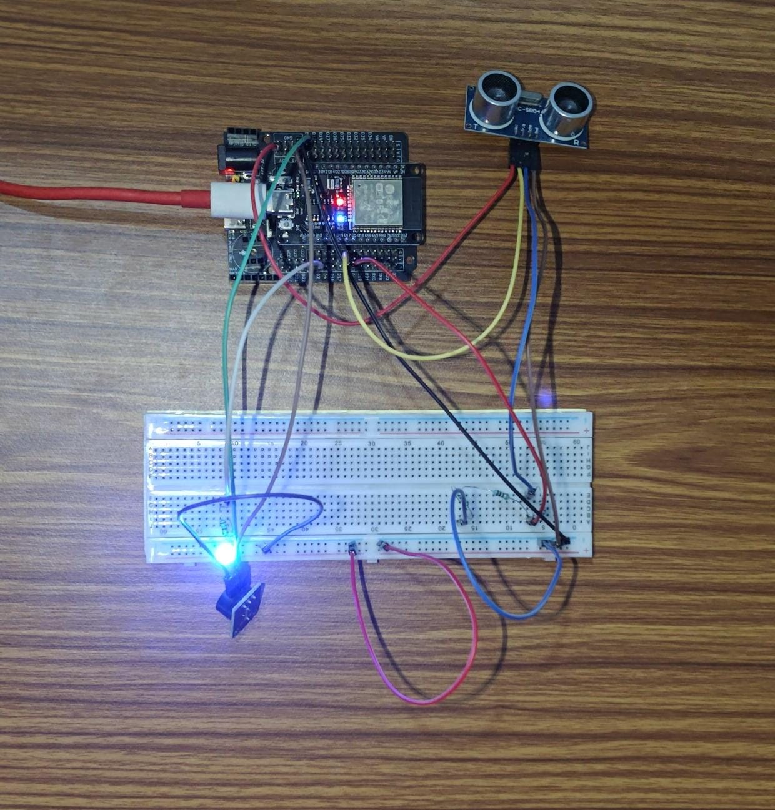

# ESP32 Smart Parking Sensor

## Project Overview

This project is an ESP32-based smart parking sensor that uses an HC-SR04 ultrasonic sensor to measure the distance between the sensor and an object.

The ESP32 processes the measured distance and indicates the parking status using an LED and buzzer.

## Features

- Ultrasonic distance measurement
- Parking occupied detection
- Parking available indication
- LED blinking alert
- Buzzer sound alert
- Serial Monitor distance display
- ESP32 GPIO interfacing
- Non-blocking timing using `millis()`

## Hardware Components

- ESP32 development board
- HC-SR04 ultrasonic sensor
- 3-pin buzzer module
- LED
- 220Ω resistor
- 1kΩ resistors
- Breadboard
- Jumper wires

## Project Hardware

*Working prototype using ESP32, HC-SR04 ultrasonic sensor, LED, buzzer, and breadboard circuitry.*

## Pin Connections

| Component | Pin | ESP32 |
|---|---|---|
| HC-SR04 | VCC | VIN / 5V |
| HC-SR04 | GND | GND |
| HC-SR04 | TRIG | GPIO 5 |
| HC-SR04 | ECHO | GPIO 18 through resistor divider |
| Buzzer | S | GPIO 13 |
| Buzzer | + | 3V3 |
| Buzzer | - | GND |
| LED | Positive | GPIO 2 through 220Ω resistor |
| LED | Negative | GND |

> **Note:** The HC-SR04 ECHO signal is connected to the ESP32 through a resistor divider to reduce the signal voltage before it reaches the ESP32 GPIO.

## Working Principle

1. The ESP32 sends a trigger pulse to the HC-SR04 ultrasonic sensor.
2. The HC-SR04 sends an ultrasonic pulse and receives the reflected echo.
3. The ESP32 measures the echo duration.
4. The echo duration is used to calculate the distance to the object.
5. The measured distance is compared with a 20 cm threshold.
6. If the distance is greater than 20 cm, the parking space is considered available.
7. If the distance is 20 cm or less, the parking space is considered occupied.
8. When the parking space is occupied, the LED and buzzer provide an alert.

## Testing

The system was tested by placing an object at different distances from the HC-SR04 ultrasonic sensor.

| Condition | Distance | Expected Result |
|---|---:|---|
| Parking available | > 20 cm | No alert |
| Parking occupied | ≤ 20 cm | LED and buzzer alert |

Distance measurements were monitored through the Arduino Serial Monitor during testing.

## Technologies Used

- ESP32
- Embedded C/C++
- Arduino IDE
- HC-SR04 ultrasonic sensor
- GPIO programming
- Serial communication
- `millis()`-based non-blocking timing

## Future Improvements

- OLED display
- Multiple parking slots
- Wi-Fi monitoring
- MQTT integration
- Mobile dashboard
